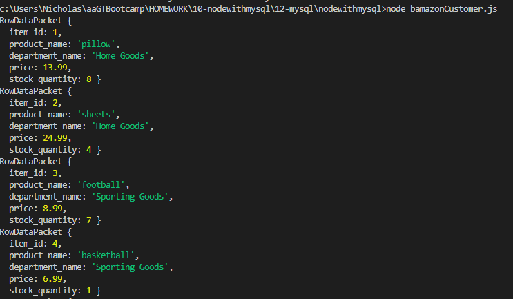
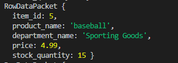
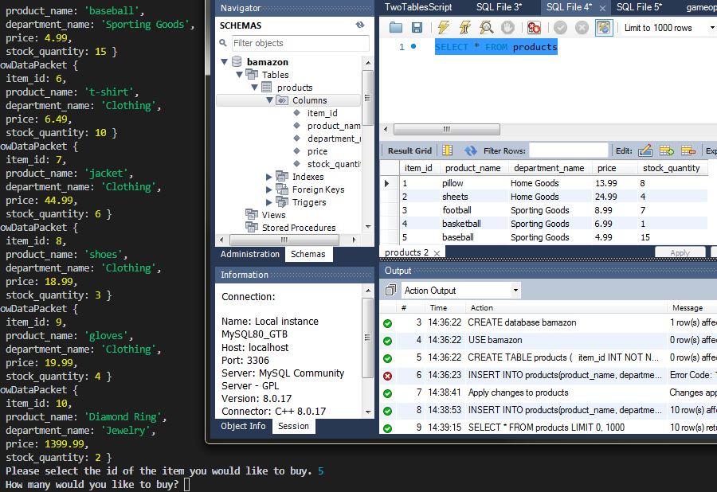
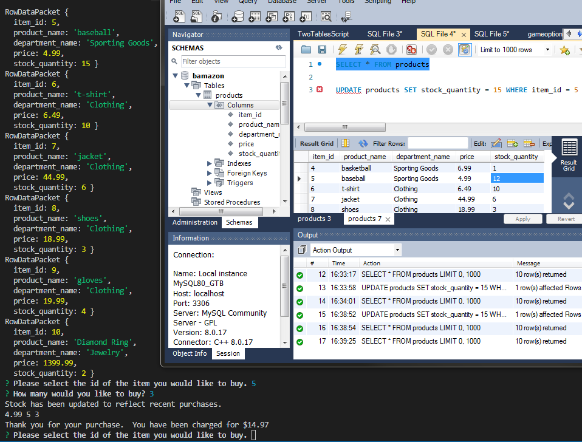

# nodewithmysql

This project is a command line application that uses mysql and inquirer node packages to track customer purchases of inventory.  A customer selects the item they want by id, and selects the quantity to purchase.  If there is sufficient quantity of the item, the database is then updated with the changes to stock and the customer is given the price of their order.

Images can be found in the img folder.

1.  
2.  
3.  
4.  
